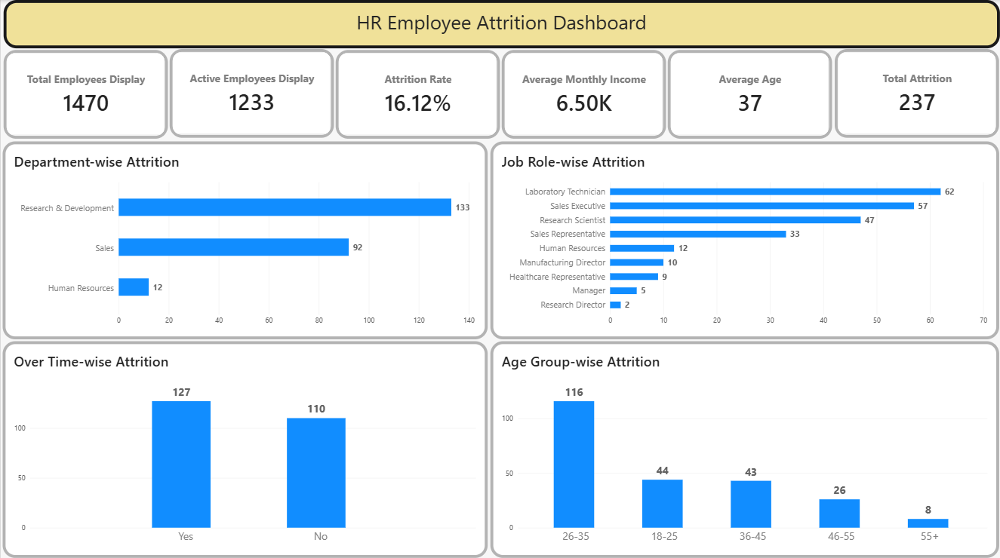
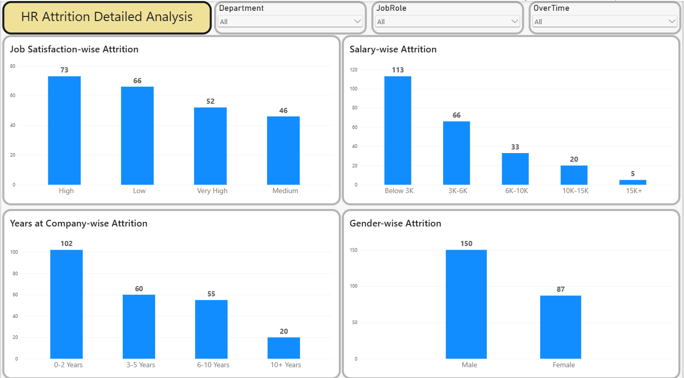

# HR Employee Attrition Analysis

## 📌 Project Overview

This project analyzes employee attrition data to identify key factors influencing employee turnover. The analysis was performed using **Excel, MySQL, and Power BI**.

The project focuses on understanding attrition patterns based on departments, job roles, overtime, age groups, salary, job satisfaction, tenure, and gender.

---

## 🛠️ Tools & Technologies

- **Excel** – Data Cleaning and Preparation
- **MySQL** – Data Analysis and SQL Queries
- **Power BI** – Data Visualization and Interactive Dashboard
- **DAX** – KPI Measures and Calculations

---

## 📂 Dataset

The dataset contains **1,470 employee records** with information related to:

- Age
- Department
- Job Role
- Gender
- Monthly Income
- Job Satisfaction
- OverTime
- Years at Company
- Marital Status
- Attrition

---

## 🧹 Data Cleaning

The dataset was cleaned and prepared before analysis.

Key steps included:

- Checked for missing values
- Checked for duplicate records
- Removed unnecessary or constant columns
- Verified data types
- Created meaningful categorical groups for analysis

---

## 🗄️ SQL Analysis

The dataset was analyzed using **MySQL** to answer key business questions.

### Key Analysis Performed

1. Total Employees
2. Total Attrition
3. Overall Attrition Rate
4. Department-wise Attrition
5. Job Role-wise Attrition
6. Gender-wise Attrition
7. OverTime-wise Attrition
8. Age Group-wise Attrition
9. Salary-wise Attrition
10. Years at Company-wise Attrition
11. Marital Status-wise Attrition
12. Job Satisfaction-wise Attrition

---

## 📊 Power BI Dashboard

An interactive **2-page Power BI dashboard** was created.

### Dashboard KPIs

- Total Employees
- Active Employees
- Total Attrition
- Attrition Rate
- Average Monthly Income
- Average Age

### Key Visualizations

- Department-wise Attrition
- Job Role-wise Attrition
- OverTime-wise Attrition
- Age Group-wise Attrition
- Job Satisfaction-wise Attrition
- Salary-wise Attrition
- Years at Company-wise Attrition
- Gender-wise Attrition

### Interactive Filters

- Department
- Job Role
- OverTime

---

## 📈 Key Insights

- The dataset contains **1,470 employees**.
- **237 employees** left the organization.
- The overall attrition rate is **16.12%**.
- The **26–35 age group** has the highest number of attrition cases.
- Attrition varies across departments and job roles.
- Overtime, salary, job satisfaction, and tenure show important attrition patterns.

---

## 📁 Project Structure

```text
HR-Employee-Attrition-Analysis
│
├── Data
│   └── HR_Employee_Attrition_Cleaned.csv
│
├── SQL
│   └── HR_Attrition_Analysis.sql
│
├── PowerBI
│   └── HR_Employee_Attrition_Dashboard.pbix
│
├── Screenshots
│   ├── Dashboard_Page1.png
│   └── Dashboard_Page2.png
│
└── README.md
```

---

## 📸 Dashboard Preview

### HR Employee Attrition Dashboard



### HR Attrition Detailed Analysis



---

## 👤 Author

**Sudeep Pathak**

- LinkedIn: www.linkedin.com/in/sudeep-pathak-4b119038b
- GitHub: github.com/sudeep9685
